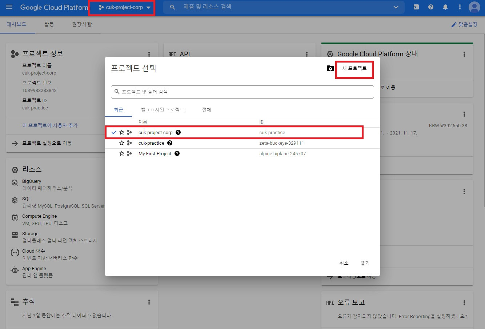
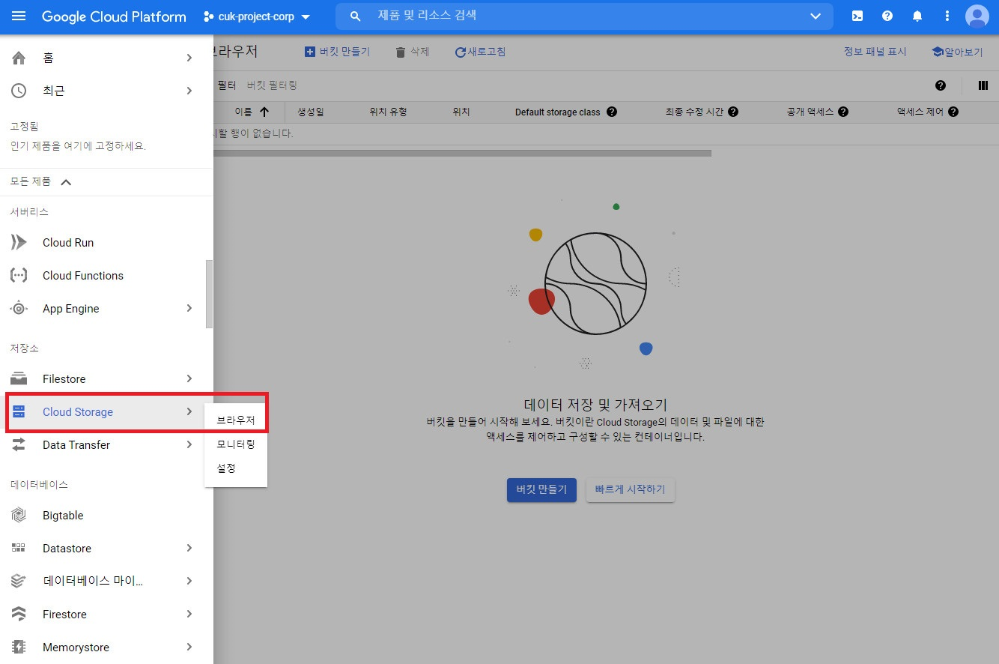
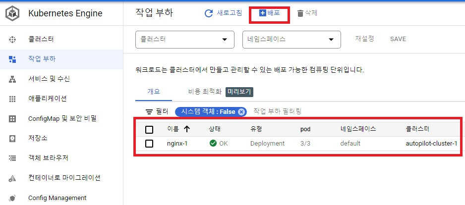

# GCP_실습 1

## Cloud Storage

### Web을 Cloud Storage 파일 관리

- GCP Console 로 접속 (https://console.cloud.google.com/)

- GCP project 생성 및 선택



- Cloud Storage로 이동




- 버킷 이름 만들기
  * 버킷 버전 관리 활성화


- 버킷에 파일 업로드

- 객체 확인

- 같은 객체를 다시 업로드

- 버전 확인하기


### GSutil 을 이용한 Cloud Storage 

- Windows terminal을 이용하여, 아래의 명령어로 gsutil 설치

```
(New-Object Net.WebClient).DownloadFile("https://dl.google.com/dl/cloudsdk/channels/rapid/GoogleCloudSDKInstaller.exe", "$env:Temp\GoogleCloudSDKInstaller.exe")

& $env:Temp\GoogleCloudSDKInstaller.exe
    
```

- gcloud init 명령어로 Project 권한 획득
  * 이때 region 은 asia-northeast3(서울) 로 선택한다.

```
gcloud init
```

- gstuil version 확인

```
gsutil version -l
```

- 새 버킷 만들기

```
gsutil mb gs://BUCKET_NAME
```

- 버킷에 객체 업로드 

```
gsutil cp OBJECT_LOCATION gs://DESTINATION_BUCKET_NAME/
```
- 버킷 삭제

```
gsutil rm -r gs://BUCKET_NAME
```


## Artifact Registry 실습

- Artifact Registry 저장소 만들기


- docker 레지스트리에 대한 권한 인증


```
gcloud auth configure-docker asia-northeast3-docker.pkg.dev
```


- 만든 저장소의 레파지토리 복사


- nginx 도커 이미지를 공식 도커 허브에서 가져오기

```
docker pull nginx
```

- GCP registry 를 위한 도커 이미지 태깅


```
docker tag nginx asia-northeast3-docker.pkg.dev/cuk-practice/docker-registry/nginx
```

- docker push

```
docker push asia-northeast3-docker.pkg.dev/cuk-practice/docker-registry/nginx
```


## GKE 실습

### GKE Autopilot을 이용한 k8s 클러스터 실습

- Autopilot 기반으로 GKE 생성
  * 배포되는 pod의 개수를 기반으로 컴퓨팅 리소스가 탄력적으로 증감

- web 을 통한 컨테이너 배포




- kubectl context 가져오기

```
gcloud container clusters get-credentials autopilot-cluster-1 --region asia-northeast3 --project cuk-practice
```
